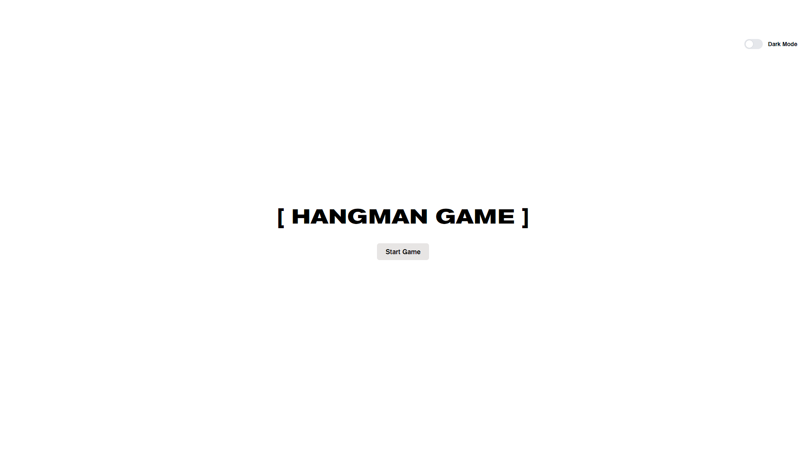

# [Hangman Game](https://mshabunin97.github.io/hangman-game/)

This is a simple implementation of the classic Hangman game, where your task is to guess the hidden word by suggesting letters. Each correctly guessed letter will be revealed in its corresponding position in the word, while each incorrect guess will add a part to the hangman drawing. The game continues until the word is guessed correctly or the hangman drawing is completed.

## Features

* Randomly selects a word from a predefined list.
* Tracks the number of remaining attempts and displays it to the player.
* Shows placeholders for letters in the guessed word.
* Allows the player to input letters by clicking on the buttons of the virtual on-screen keyboard.
* Updates the hangman drawing and reduces the number of attempts for incorrect guesses.
* Notifies the player of victory or defeat at the end of the game.
* Provides the option to play again and start a new game.

## How to Play

1. Start the game.
2. You will be presented with a set of underscores representing the letters of the hidden word.
3. Click on the buttons of the virtual on-screen keyboard to guess the letters.
4. If the guessed letter is correct, it will be revealed in the word. Otherwise, the hangman drawing will be updated, and the number of attempts will decrease.
5. Continue guessing letters until you either guess the word and win or exhaust all attempts and lose.
6. At the end of the game, you can choose to play again and start a new game.

## Installation
1. Clone the repository to your computer.
2. Open the project directory in your preferred code editor.
3. Open the index.html file in a web browser.
4. Alternatively, simply click on the provided link to play Hangman Game.

    That's it! Now you can play the Hangman game in your web browser.
